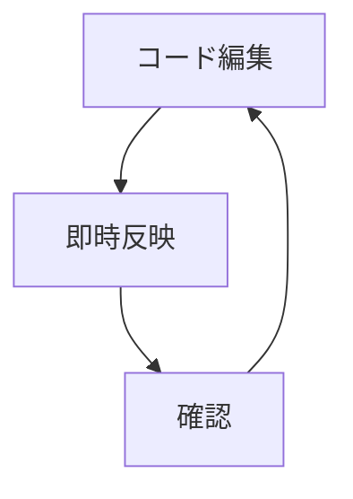

# Mermaid 2.0で進化するダイアグラム作成 - 開発者のための実践ガイド

開発者にとって、システム設計やプロセスフローの可視化は不可欠なスキルです。2025年2月にリリースされたMermaid 2.0は、テキストベースのダイアグラム作成に革新的な進化をもたらしました。本記事では、最新のMermaidが提供する新機能と、それらを実践的に活用する方法をご紹介します。

## 目次
1. [Mermaid 2.0の革新的な新機能](#新機能)
2. [実践的な活用シーン](#活用シーン)
3. [開発効率を高める統合機能](#統合機能)
4. [今後の展望とエコシステム](#展望)

## Mermaid 2.0の革新的な新機能 {#新機能}

### リアルタイムプレビューの進化

最新のVS Code拡張機能では、コードを編集するとリアルタイムでダイアグラムが更新されるようになりました。これにより、試行錯誤のサイクルが大幅に短縮され、より直感的な図表作成が可能になっています。

### AI支援機能の統合

**AIによるダイアグラム生成**が新たに追加され、アイデアやソースコードから直接図表を作成できるようになりました。例えば、システム構成の説明文から自動的にアーキテクチャ図を生成することが可能です。

## 実践的な活用シーン {#活用シーン}

### システム設計での活用

クラス図の機能が大幅に強化され、より表現力豊かな設計図が作成可能になりました。特に新しい「classBox」形状と手書き風の外観は、概念設計の段階で効果的です。

### アジャイル開発での活用

新たに追加された**カンバンボード**機能により、プロジェクト管理がより視覚的になりました。タスクの進捗状況を簡単に可視化し、チーム全体で共有できます。

## 開発効率を高める統合機能 {#統合機能}

### エラーハイライト機能

構文エラーをリアルタイムで検出し、問題箇所を明確に示してくれる機能が追加されました。これにより、特に初心者の学習曲線が緩やかになっています。

### パン＆ズーム機能

大規模なダイアグラムでも細部まで確認しやすくなり、複雑なシステム設計の可視化が容易になりました。

## 今後の展望とエコシステム {#展望}

Mermaidは単なる図表作成ツールから、開発ワークフロー全体を支援する統合環境へと進化しています。AIとの連携強化や、よりインタラクティブな機能の追加が予定されています。

## まとめ

Mermaid 2.0は、開発者の作業効率を大幅に向上させる機能を提供しています。特にAI支援機能とリアルタイムプレビューは、図表作成の新しい標準となるでしょう。

あなたも今日から、Mermaidを使って効率的なドキュメント作成を始めてみませんか？

#テック #開発ツール #Mermaid #システム設計 #プログラミング #VS Code #技術文書 #可視化