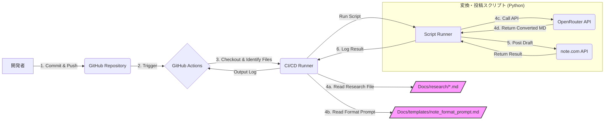

# LLM情報収集結果 note記事化システム 仕様書

## 1. 概要

### 1.1 背景
日々の情報収集に複数のLLMサービス（ChatGPT, Perplexity, Grok, Claudeなど）を利用しているが、調査結果が各プラットフォームに分散し、後で参照しにくい。また、対話形式の調査では、会話スレッドを追わないと流れが分かりにくい場合がある。

### 1.2 目的
`Docs/research/` ディレクトリに保存されたMarkdown形式のLLM調査結果を、LLMを利用して分かりやすいnote記事形式に自動変換し、note.comに自動公開する仕組みを構築する。これにより、情報の一元管理と参照性の向上、および知識共有の効率化を目指す。

## 2. 要件定義

### 2.1 機能要件
- **入力**: `Docs/research/` ディレクトリ内のMarkdown形式のLLM調査結果ファイル。
- **トリガー**: 上記ディレクトリへのGitコミットをフックして処理を開始する。
- **変換処理**:
    - 指定されたMarkdownファイルを読み込む。
    - OpenRouter API を利用して、指定されたフォーマットファイル（Markdown形式、別途定義）を参照しつつ、note記事形式のMarkdownコンテンツに変換する。
- **出力**: 変換されたMarkdownコンテンツ。
- **公開処理**:
    - note.comの非公式APIを利用して、変換された記事を下書き状態で投稿する。
    - 最終的な記事の公開は手動で行う。
- **承認プロセス**: 自動処理における承認ステップは不要（下書き投稿のため）。

### 2.2 非機能要件（現時点）
- **自動化**: Gitコミットからnote下書き投稿までを自動化する。
- **柔軟性**: OpenRouter APIを利用することで、記事変換に使用するLLMモデルを柔軟に変更できるようにする。
- **フォーマット**: 記事のフォーマットは別途定義したファイルで管理し、変換指示時に参照する。

## 3. 機能仕様

### 3.1 処理フロー概要
1.  **トリガー**: 開発者が `Docs` リポジトリにコミットし、プッシュする。
2.  **CI/CDパイプライン起動**: GitHub ActionsなどのCI/CDサービスがプッシュイベントを検知し、ワークフローを開始する。
3.  **変更ファイル特定**: ワークフロー内で、コミットによって追加・変更されたファイルのうち、`Docs/research/` ディレクトリ配下のMarkdownファイル（`.md`）を特定する。
4.  **記事変換処理**: 特定された各Markdownファイルに対して、以下の処理を実行する。
    a.  **ファイル読み込み**: Markdownファイルの内容を読み込む。
    b.  **フォーマット指示読み込み**: 事前に定義されたnote記事用フォーマット指示Markdownファイル (`Docs/templates/note_format_prompt.md` とする) の内容を読み込む。
    c.  **OpenRouter API呼び出し**: 読み込んだ調査結果Markdownとフォーマット指示Markdownを組み合わせたプロンプトを作成し、OpenRouter APIに送信してnote記事形式のMarkdown生成を依頼する。使用するモデルは設定ファイルまたは環境変数で指定可能とする（デフォルトは `anthropic/claude-3.5-sonnet` など）。
    d.  **変換結果取得**: OpenRouter APIから変換後のMarkdownコンテンツを取得する。
5.  **note.com下書き投稿**: 変換されたMarkdownコンテンツを、note.comの非公式APIを使用して下書きとして投稿する。
6.  **結果通知**: 処理結果（成功・失敗、投稿された下書きURLなど）をワークフローのログに出力する。

### 3.2 コンポーネント詳細
#### 3.2.1 CI/CDワークフロー (GitHub Actions例)
-   **トリガー**: `on: push: branches: [ main ] paths: [ 'Docs/research/**.md' ]`
-   **ジョブ**:
    -   リポジトリをチェックアウトする。
    -   変更された `Docs/research/*.md` ファイルを特定するスクリプトを実行する。
    -   特定されたファイルごとに、変換・投稿処理を実行するPythonスクリプト（または他の言語のスクリプト）を呼び出す。
    -   必要なAPIキー（OpenRouter, note.com）はGitHub Secretsから環境変数としてスクリプトに渡す。

#### 3.2.2 変換・投稿スクリプト (Python例)
-   **入力**: 処理対象のMarkdownファイルパス、OpenRouter APIキー、note.com APIキー/トークン、使用するOpenRouterモデル名、フォーマット指示ファイルパス。
-   **処理**:
    -   入力ファイルとフォーマット指示ファイルを読み込む。
    -   OpenRouter APIクライアントライブラリを使用してAPIを呼び出す。
        -   適切なプロンプトを構築する。
        -   タイムアウト設定、エラーハンドリング（リトライ含む）を実装する。
    -   MarkdownからHTMLへの変換:
        -   Pythonの`markdown2`ライブラリを使用して、変換後のMarkdownをHTMLに変換する。
        -   コードブロック、画像、リンクなどの特殊要素を適切に処理する。
    -   note.com 非公式APIを呼び出すためのHTTPリクエストを送信する。
        -   APIエンドポイント、リクエストヘッダー（認証情報含む）、リクエストボディ（変換後HTML）を正しく設定する。
        -   レスポンスを解析し、下書きURLなどを取得する。
        -   エラーハンドリングを実装する。
-   **出力**: 処理結果（ログ、下書きURL）。

#### 3.2.3 フォーマット指示ファイル (`Docs/templates/note_format_prompt.md`)
-   note記事として適切な構成、文体、見出しレベル、コードブロックの扱い、画像の扱いなどを指示するMarkdown形式のプロンプト。
-   **記事構成の基本**:
    -   導入部：読者の興味を引く一文で始める
    -   目次：3〜5個の大項目に整理
    -   本文：段落は3〜4行程度に抑え、見出し（H2、H3タグ）を効果的に使用
    -   具体例とエピソード：説得力を高めるため、具体例やエピソードを交える
    -   ビジュアル要素：関連性の高い画像や図解を効果的に活用
    -   まとめ：主要ポイントを簡潔に再確認し、読者に対する行動喚起を含める

-   **SEO対策**:
    -   h1（タイトル）、h2（大見出し）、h3（小見出し）に関連キーワードを含める
    -   適切なハッシュタグを設定

-   **読みやすさの向上**:
    -   箇条書きやナンバリングを活用
    -   重要なポイントは太字やイタリック体で強調
    -   適度な空白を設ける
    -   モバイルフレンドリーなレイアウトを意識

-   **エンゲージメント向上**:
    -   読者への問いかけや質問を織り交ぜる
    -   コメント欄での意見交換を促す
    -   次のステップや関連記事へのリンクを提供

-   このファイルは別途作成・管理する。

#### 3.2.4 note.com 非公式API
-   **実装詳細**:
    -   **認証**: ログイン後のセッションクッキーや認証トークンを取得する必要があります。認証情報は安全に管理し、GitHub Secretsで保管します。
    -   **MarkdownからHTMLへの変換**: Pythonの`markdown2`ライブラリを使用して、MarkdownコンテンツをHTMLに変換します。
    -   **ドラフト保存エンドポイント**: POSTメソッドを使用し、以下の形式でリクエストを送信します：
        ```json
        {
            "body": "変換後のHTMLコンテンツ",
            "index": false
        }
        ```
    -   **公開方法**: 現時点では、ドラフトを投稿した後、note.comのウェブサイトで手動で公開する必要があります。

-   **注意事項**:
    -   非公式APIは予告なく変更される可能性があります。
    -   サーバーに過度な負荷をかける行為は禁止されています。
    -   認証情報やトークンの取り扱いには注意が必要です。
    -   ドラフト保存後の公開手順が手動であるため、完全自動化は難しい場合があります。

-   **エラーハンドリング**:
    -   認証エラー、APIエンドポイントの変更、レートリミット超過などのエラーを適切にハンドリングします。
    -   エラー発生時はログに記録し、必要に応じて開発者に通知します。

## 4. 非機能要件

### 4.1 性能
-   **変換・投稿時間**: 1つのMarkdownファイルに対する変換処理とnote.comへの下書き投稿処理は、通常時（外部APIが正常稼働時）において、現実的な時間内（例: 5分以内を目安）に完了することを目指す。ただし、OpenRouter APIの応答速度やnote.com APIの状況に依存するため、厳密な時間保証は行わない。
-   **同時処理**: CI/CDパイプラインは、複数のファイルが同時にコミットされた場合でも、各ファイルに対して処理を実行できること。ただし、APIのレートリミットに注意が必要。

### 4.2 信頼性
-   **エラーハンドリング**: ファイル読み込みエラー、API呼び出しエラー（タイムアウト、認証エラー、レートリミット超過など）、データ形式エラーなどを適切にハンドリングし、処理が異常終了した場合は、原因を示すエラーメッセージをログに出力する。
-   **リトライ処理**: 一時的なネットワークエラーやAPIエラーに対して、限定的なリトライ処理（例: 3回まで、指数バックオフ）を実装することを検討する。
-   **非公式APIのリスク**: note.comの非公式APIは不安定である可能性や、仕様変更・停止のリスクがあることを認識し、エラー発生時のログ記録や通知を強化する。

### 4.3 保守性
-   **コード品質**: 処理スクリプト（Python等）は、可読性が高く、適切な命名規則に従い、モジュール化されていること。設定値（APIキー、モデル名、ファイルパスなど）はコード内にハードコーディングせず、設定ファイルや環境変数から読み込むようにする。
-   **設定管理**: OpenRouterのモデル名、フォーマット指示ファイルのパスなどは設定ファイルやCI/CDの変数で管理し、変更を容易にする。
-   **ドキュメント**: コード内コメントやREADMEに必要な情報を記述し、メンテナンスを容易にする。

### 4.4 セキュリティ
-   **機密情報管理**: OpenRouter APIキーやnote.comの認証トークンなどの機密情報は、GitHub Secretsなどの安全な場所に保管し、ワークフロー実行時にのみ環境変数として渡す。コードやログに機密情報が直接含まれないように注意する。

### 4.5 拡張性
-   **モデル変更**: OpenRouterで利用可能な他のLLMモデルへの切り替えが容易であること。
-   **フォーマット追加**: 新しいnote記事フォーマット用の指示ファイルを追加・変更しやすい構成とする。
-   **機能追加**: 将来的に他の出力先プラットフォーム（例: Zenn, Qiita）への対応や、画像処理などの機能追加を考慮した設計とする（現時点では必須ではない）。

### 4.6 運用性
-   **ログ**: ワークフローの実行開始・終了、処理対象ファイル、変換処理の成否、投稿処理の成否、投稿された下書きURL、発生したエラーなどの情報を、CI/CDのログに分かりやすく出力する。
-   **監視**: ワークフローの実行失敗時には、GitHub Actionsなどの通知機能を利用して開発者に通知することを検討する。

## 5. システム構成



**コンポーネント:**

-   **GitHub Repository**: ソースコードとドキュメント（`Docs/research/` を含む）を管理。
-   **GitHub Actions**: CI/CDパイプライン。プッシュをトリガーにワークフローを実行。
-   **CI/CD Runner**: ワークフローのジョブを実行する環境。
-   **変換・投稿スクリプト**: Pythonで実装。ファイルの読み込み、OpenRouter API呼び出し、note.com API呼び出しを行う。
-   **OpenRouter API**: LLMによるMarkdown変換サービス。
-   **note.com API (非公式)**: note.comへの下書き投稿用インターフェース。
-   **設定ファイル/環境変数**: APIキー、モデル名、ファイルパスなどを管理。GitHub Secretsを活用。

## 6. 今後の課題

-   **note.com 非公式APIの調査**:
    -   APIの安定性、利用規約、認証方法、下書き投稿機能の詳細などを調査し、実現可能性とリスクを評価する。
    -   代替手段（例: note公式のインポート機能、手動投稿の効率化）も検討する。
-   **フォーマット指示ファイルの作成**: `Docs/templates/note_format_prompt.md` の具体的な内容を作成する。様々な調査結果に対応できる汎用性と、note記事としての品質を両立させるプロンプト設計が必要。
-   **LLMモデルの選定と評価**: OpenRouterで利用可能なモデルの中から、コスト、性能（変換品質、速度）、安定性などを考慮して最適なモデルを選定する。複数のモデルを試用し、比較評価を行う。
-   **エラーハンドリングの詳細化**: 具体的なエラーケース（APIエラー、ファイル破損、予期せぬLLM応答など）を想定し、それぞれに対するハンドリング方法（ログ記録、通知、リトライ、処理中断など）を詳細に設計する。
-   **変換品質の評価と改善**: 実際にいくつかの調査結果ファイルで変換を試し、生成されるnote記事の品質を評価する。必要に応じて、フォーマット指示プロンプトの改善や、LLMへの指示方法（Few-shotプロンプティングなど）の工夫を行う。
-   **コスト管理**: OpenRouter APIの利用料金を把握し、予算内に収まるように利用頻度やモデル選択を管理する方策を検討する。
-   **テスト**: CI/CDパイプラインや変換・投稿スクリプトに対するテスト（ユニットテスト、結合テスト）を計画・実装する。特に外部API連携部分のモック化やテスト方法を検討する。
